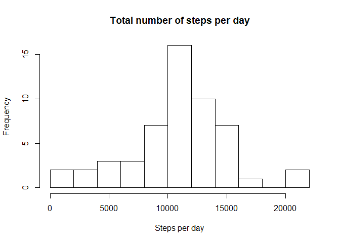
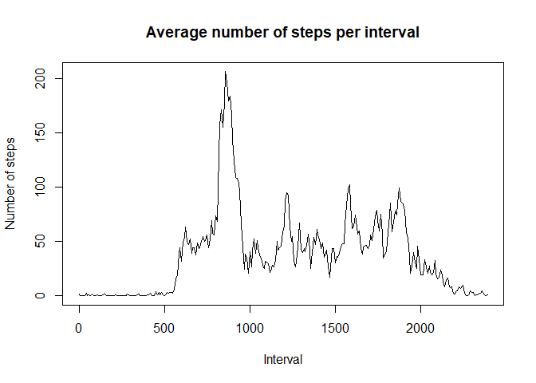
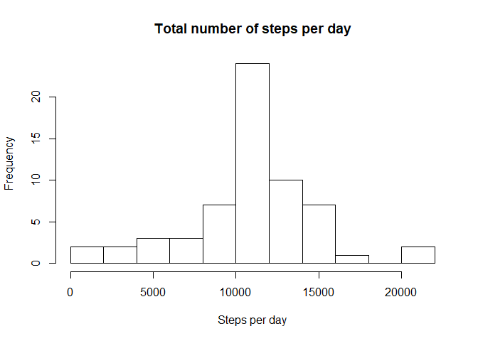
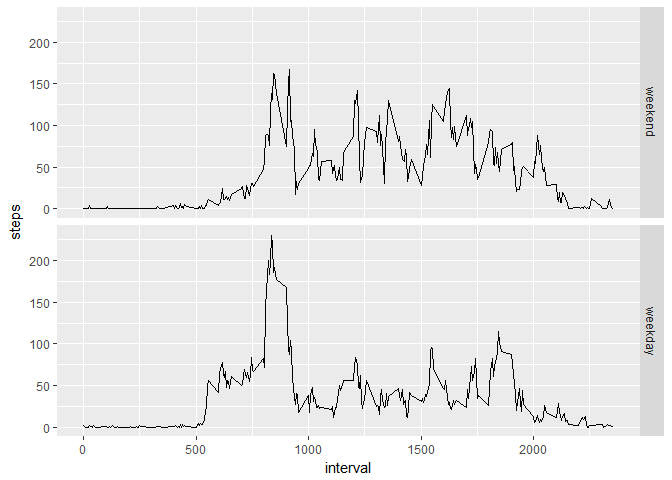

In this assignment, we study data about personal movement collected by a personal activity monitoring device. The data was collected by one individual in October and November 2012. The number of steps per 5 minute interval was measured each day.

We will answer the following questions:

* What is mean and median of the total number of steps taken per day? 
* What is the average daily activity pattern?
* How does imputing missing values influence the mean and median of the total number of steps taken per day?
* Are there differences in activity patterns between weekdays and weekends?

## Loading and preprocessing the data
The first step is loading the data. The data is stored in a zip file, called 'activity.zip'. Before running the next block of code, unzip it to a file called 'activity.csv'. We read the dataset into a variable called 'data'.

```r
data <- read.csv("activity.csv")
```
Let's take a look at the structure of the data:

```r
str(data)
```

```
## 'data.frame':	17568 obs. of  3 variables:
##  $ steps   : int  NA NA NA NA NA NA NA NA NA NA ...
##  $ date    : Factor w/ 61 levels "2012-10-01","2012-10-02",..: 1 1 1 1 1 1 1 1 1 1 ...
##  $ interval: int  0 5 10 15 20 25 30 35 40 45 ...
```
We see that the dataset has 17568 rows and three variables: 'steps' (integer), 'date' (factor) and 'interval' (int). To simplify the analysis easier, we convert the date variable into a variable of class Date.

```r
data$date <- as.Date(data$date, "%Y-%m-%d")
```
Next, let's see whether the data is complete.
The total number of missing values in the dataset is 

```r
sum(is.na(data$steps))
```

```
## [1] 2304
```
This is pretty high, compared to the total number of observations (17568).
In the first parts of this report, we will only take into account the interval for which the number of steps is known.
The relevant subset of the data can be created by the following block of code:

```r
data_with_steps <- subset(data, !is.na(steps))
str(data_with_steps)
```

```
## 'data.frame':	15264 obs. of  3 variables:
##  $ steps   : int  0 0 0 0 0 0 0 0 0 0 ...
##  $ date    : Date, format: "2012-10-02" "2012-10-02" ...
##  $ interval: int  0 5 10 15 20 25 30 35 40 45 ...
```

## What is mean total number of steps taken per day?
After loading the data, we look at the average number of steps per day. For now, we ignore the missing values in the dataset.
The distribution of the total number of steps per day is shown in the histogram below.

```r
steps_per_day <- with(data_with_steps, tapply(steps, date, sum))
hist(steps_per_day, breaks=10, xlab="Steps per day", ylab="Frequency", main="Total number of steps per day")
```

<!-- -->

The mean and median can easily be calculated:

```r
mean_steps <- mean(steps_per_day)
median_steps <- median(steps_per_day)
```
We find that the mean is 10766.19 and the median is 10765.

## What is the average daily activity pattern?
Next, we look at the daily activity pattern. It is to be expected for the activity to be lower during nighttime than during daytime. For (almost) each day in the measured time period, we know the activity during each 5-minute interval. Taking the mean for each interval will give a good impression of the daily patterns. Again, we ignore the missing values.

```r
steps_per_interval <- with(data_with_steps, tapply(steps, interval, mean, na.rm=TRUE))
breaks=seq(1, 250, 60)
plot(steps_per_interval, type="l", xaxt='n', xlab="Interval", ylab="Number of steps", main="Average number of steps per interval")
axis(1, at=breaks, labels=names(steps_per_interval)[breaks])
```

<!-- -->

It is clear that the activity peaks between 8 and 10 a.m. The 5-minute interval in which the activity is maximal can be computed as follows:

```r
max_interval <- names(steps_per_interval[which.max(steps_per_interval)])
```
The activity is maximal in the interval with identifier 835, i.e. between 8.35 a.m. ad 8.40 a.m.

## Imputing missing values
There are a number of days and intervals for which the number of steps is missing. This may introduce bias into calculations such as the mean. For example, if the missing values are all from high activity periods, then the computed mean will too low.
As we saw befor, the total number of missing values in the dataset is 

```r
sum(is.na(data$steps))
```

```
## [1] 2304
```
or 13.1% of the total number of observations (17568). This is a substantial part of the dataset and might very well influence the mean.
Let's see how the missing values are distributed across the dataset.

```r
table(data[is.na(data$steps),"date"])
```

```
## 
## 2012-10-01 2012-10-08 2012-11-01 2012-11-04 2012-11-09 2012-11-10 
##        288        288        288        288        288        288 
## 2012-11-14 2012-11-30 
##        288        288
```
We see that there are eight days with 288 missing values each. Note that each day has exactly 5-minute intervals. This means that all measurements are missing for these eight days, and all other days are complete.
In particular, there is no skewness in the data with respect to time of the day. Therefore, the influence on the mean will probably be small.

Now we fill in the missing values. Since the activity will probably vary more by time of the day than by date, we will impute the mean of the 5-minute interval.

```r
data_extended = data
for(i in 1:dim(data_extended)[1]) {
  if(is.na(data_extended$steps[[i]])) {
    data_extended$steps[[i]] <- steps_per_interval[as.character(data$interval[i])]
  }
}
```
To see the influence of the imputed values, we again make a histogram of the total number of steps and compute the mean and median.

```r
steps_per_day_extended <- with(data_extended, tapply(steps, date, sum, na.rm=TRUE))
hist(steps_per_day_extended, breaks=10, xlab="Steps per day", ylab="Frequency", main="Total number of steps per day")
```

<!-- -->

```r
mean_extended <- mean(steps_per_day_extended)
median_extended <- median(steps_per_day_extended)
```
The shape of the histogram is similar to the histogram without imputed values. The only difference is the frequency of days with 10000 to 12000 steps. 
This is to be expected: by imputing means for the missing values, the distribution will be drawn towards the mean. 
In particular, we have seen that there are eight days completely missing from the measurements. Imputing missing values will set the number of steps for that day equal to the mean of the distribution, so the number of days with the mean number of steps will increase by eight. The other frequencies won't change at all.

The newly computed mean number of steps per day is equal to 10766.19, which is the same as before. This is to be expected because the imputed values causes 8 days to be added with the mean number of steps, so the mean shouldn't change.
The median is now 10766.19, which equals the mean.
Apparently one of the eight imputed days is the median.

## Are there differences in activity patterns between weekdays and weekends?
Some paragraps ago we made a time series plot for the number of steps per 5-minute interval. To study the differences between weekdays and weekends, we will split this plot by weekdays and weekends. We will use the dataset with the imputed values.

First we create a factor variable 'is_weekday' taking the values 'weekend' and 'weekday'. The code below tests whether the day is one of 'zaterdag' and 'zondag'. This is the equivalent of 'saturday' and 'sunday' in my locale, Dutch. Then we create a facet plot.

```r
library(dplyr)
library(ggplot2)
library(reshape2)
is_weekday = factor(weekdays(data_extended$date) %in% c("zaterdag", "zondag"), levels=c("TRUE", "FALSE"),       labels=c("weekend", "weekday"))
data_weekdays <- cbind(data_extended, is_weekday)
steps_per_interval_weekdays <- with(data_weekdays, tapply(steps, list(interval, is_weekday), mean,              na.rm=TRUE))
melted_steps_per_interval_weekdays <- melt(steps_per_interval_weekdays, id.vars="interval",                     measure.vars=c("weekend", "weekday"))
names(melted_steps_per_interval_weekdays) <- c("interval", "is_weekday", "steps")
ggplot(melted_steps_per_interval_weekdays, aes(interval, steps)) + 
  geom_line() + 
  facet_grid(is_weekday ~ .)
```

<!-- -->

From the plots we see that the activity on weekdays has a peak during morning rush hours and a smaller peak in at the beginning of the evening. In the weekend, the activity is more spread out and starts a little bit later. 
